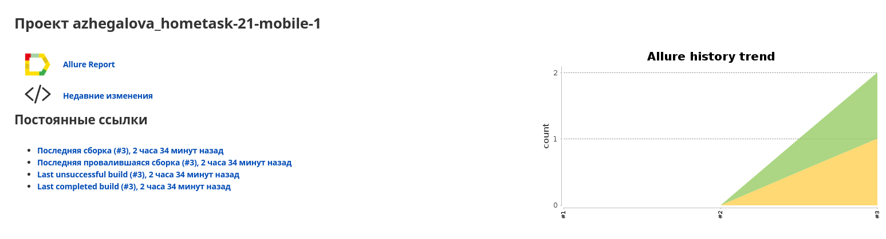
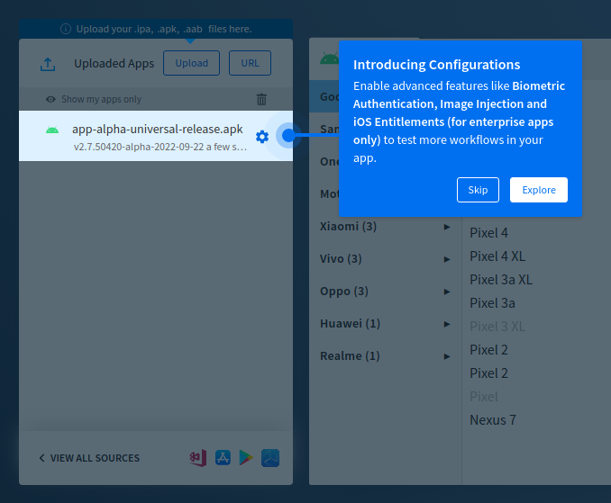
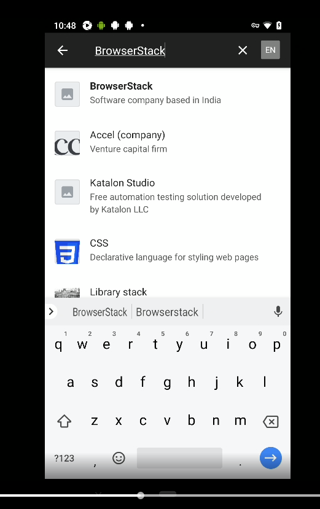
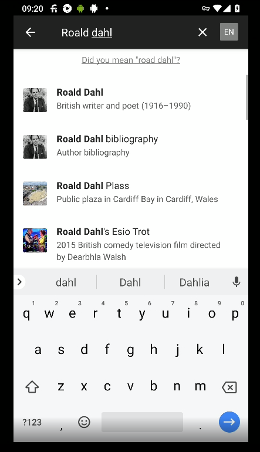
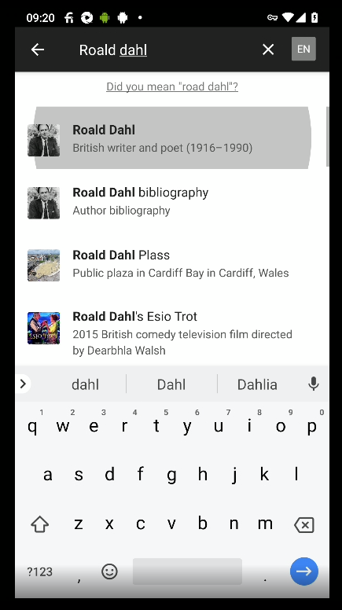

QA.GURU | Java | Автоматизация тестирования | Мобильная автоматизация

Тема задания:

* Разработка автотестов с Browserstack.

Задание:

* Зарегистрировать аккаунт в <a target="_blank" href="https://www.browserstack.com/">browserstack</a>.
* Загрузить в browserstack новую версию приложения <a target="_blank" href="https://github.com/wikimedia/apps-android-wikipedia/releases/tag/latest/">Wikipedia</a>.
* Разработать автотест на открытие любой статьи.
* Вынести данные (логин, пароль и т.д.) в .properties с owner.
* Сделать сборку в Jenkins.

Ссылки на выполненное задание в:

* <a target="_blank" href="https://jenkins.autotests.cloud/job/azhegalova_hometask-21-mobile-1/3/allure/">Jenkins job</a>.

* <a target="_blank" href="https://app-automate.browserstack.com/sessions/42e78714eb8327a34b87508d54f0462643a615db/video?token=OFdHbEdTalpTM3lZMkM5Y3ZTZjA0cG1kN3ViMVpGRTRJZHVwZmQzQWtDUHZCeWhTVEpjbm5iZFVrUTZzVmFhVUNuWW1wRFBFUGpiWFZSYlNEVGxqM0E9PS0tV0hyNlZaSzFpOEpsYUVPbDZ2aVN4dz09--1cc637cdf92be631b934d6a8a5ede6d67a3fef51&source=rest_api&diff=9.249968507/"> Browserstack video example</a>.

* Скриншоты:

 

 

 

 